# Azure-Switch_off_VMs_with_Logic_Apps

### Intro

If you are using Vms on any cloud provider the first question that you need to answer is "How much time I need my VMs up and running?"

This is a key answer about cost saving on your cloud account because the cloud pricing paradigm is based on "Pay-as-you-go"; this is a payment method for cloud computing that charges based on usage (minute or hours of running resources dependent on your could provider).

Imagine that you have a dev/test/uat/prod environment on which your application leverage. 

Probably, if your developers/tester are located in the same region, you could have impressive expenses benefits switching off non production envrionemnts outside business hours.

This is applicable especially for all istances that are running "On Demand" (without any pre booked resources).

The scope of this guide is not explain how perfrom cost saving, e.g. "On Demand" vs "Reserved" resources (I will do it into another guide :).

In this guide I explain how create with Azure Logic Apps a mechanism that allow the switch off of VMs not needed outside business hours and the switch on before the developers come back to the office in the morning.


### Tagging, Tagging everywhere

Tagging Resources on cloud is the first steps to have a proper organizzation and full control about everything on cloud.

The tags let you quickly find and anylize any kind of information of your Resources like Resource cost, Access control or simply let you proper automate the Resources.


Tag is a best practicies of any cloud provider, either if your workload is based on AWS, Azure, Google or any cloud provider.
 
This is a very usefull article that explain the tag best practicies (https://aws.amazon.com/it/answers/account-management/aws-tagging-strategies/).

To achieve the goal of this guide I will use the following tags in order to indentify the VMs that need to be swithced off-on.

The main tag that I'm going to create are:

1. on-off: [yes,no] This tag can assume two value, yes or no. This means that a VMs need to be part of switch off-on mechanism
2. on-hour: [Thh] This tag represent the on hour in UTC time. It is created with Thh (T + hh ) where hh represent the on hour
2. off-hour: [Thh] This tag represent the off hour in UTC time. It is created with Thh (T + hh ) where hh represent the off hour
3. on-group-order: [1..10] This tag is used to organize the switch on order of your VMs. It is important when a VMs need to be organize with a specific order to start (e.g. start a DB after a NFS server is up and running)
4. off-group-order: [1..10] This tag is used to organize the switch off order of your VMs. Is the dual of on-group-order

In order to proper tag our Resources we first need to create two test VMs that we will tag as reported above.

#### Create a VM in Windows Azure cloud

In this example I'm going to create two simple ubuntu servers.

Login on your Azure cloud account and click on Create a resource then click on "Ubunt server".

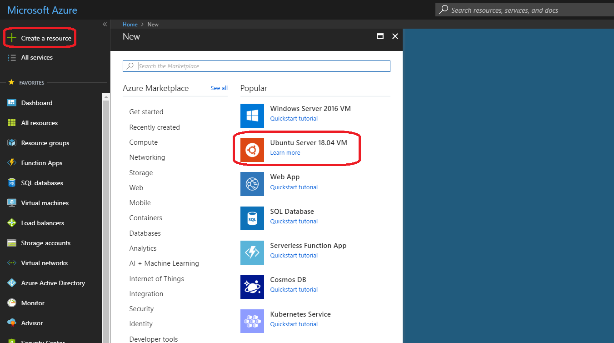

Now choose all the proper parameter to let you create properly the VM and click on "Ok".
The name of this VM is "testonoff-1".

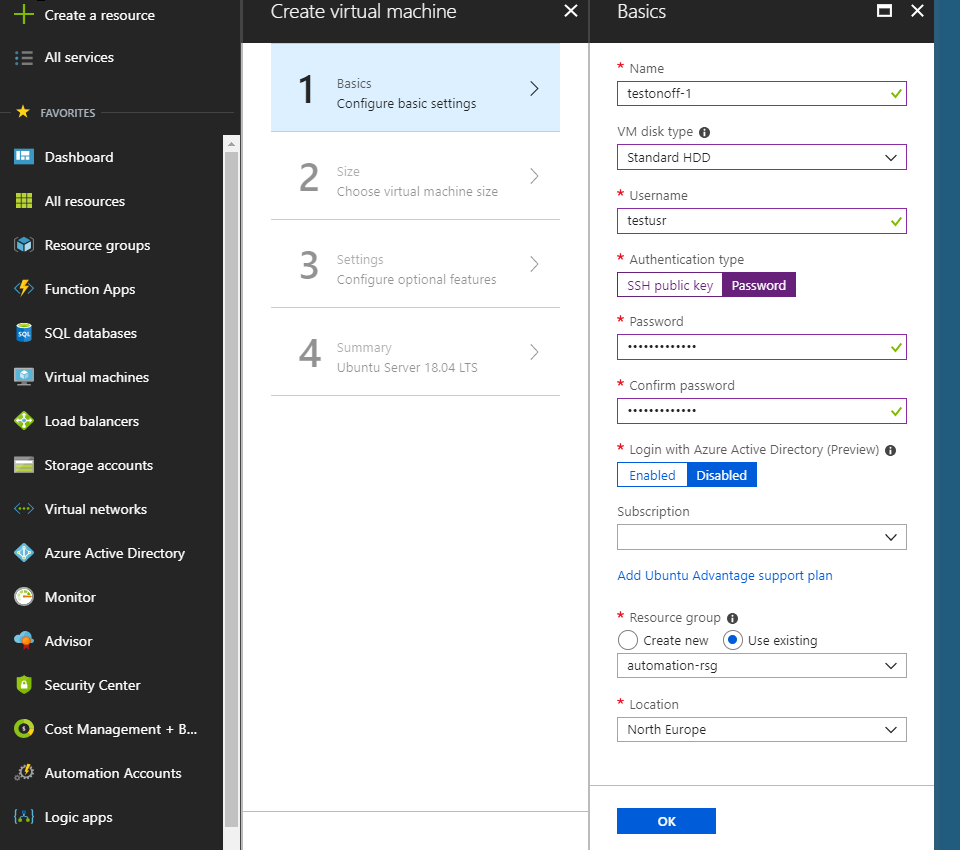

Choose the size of the VM (in this example b1s) and click on "Select"

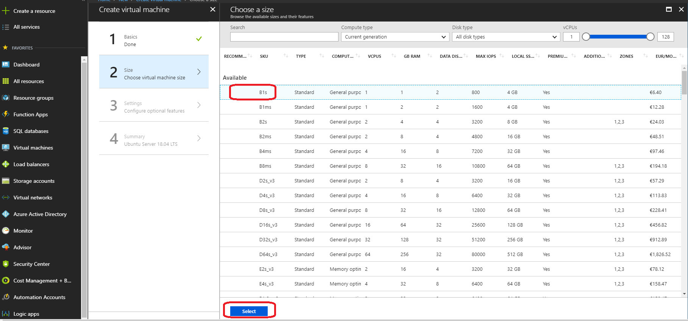

Choose the storage configuration (for the purpose of this guide is not important what kind of storage property is configured).

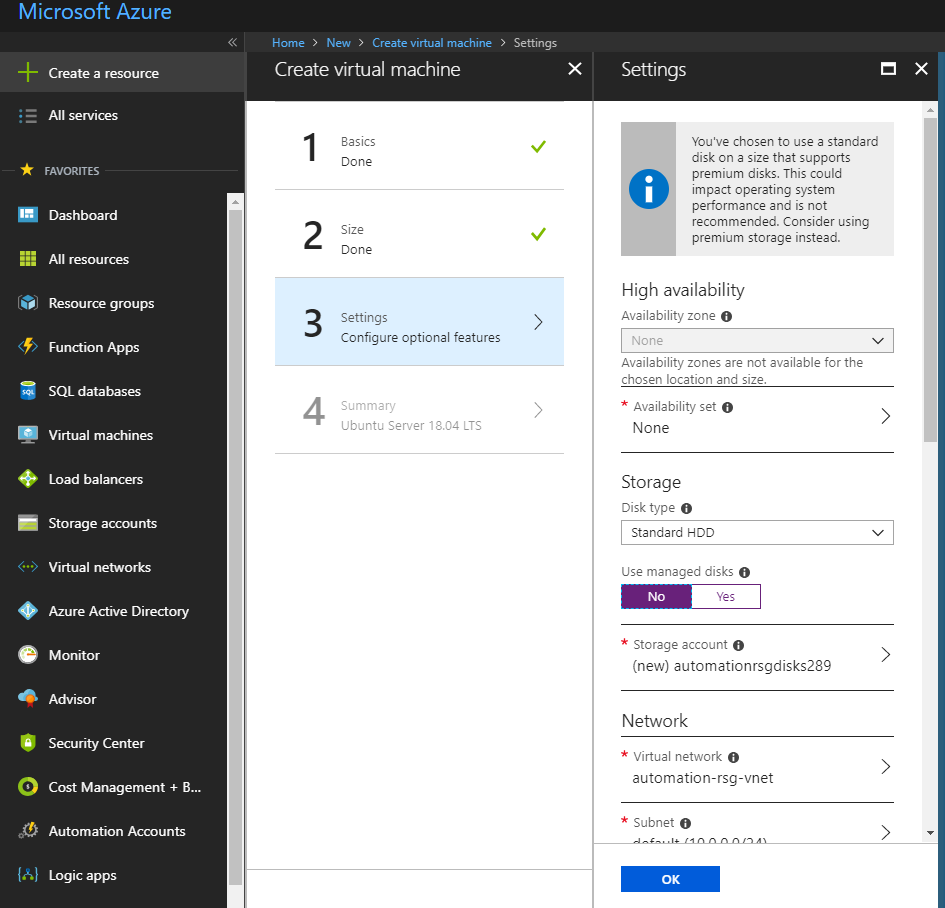

Then configure possible options and click on "Ok".

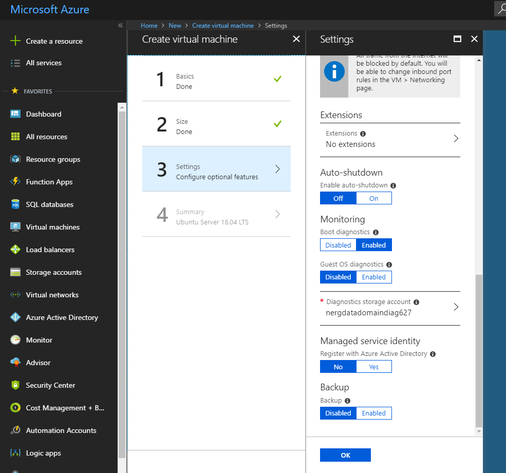

If all parameter configured are ok the Validation passed and you can create the VM.

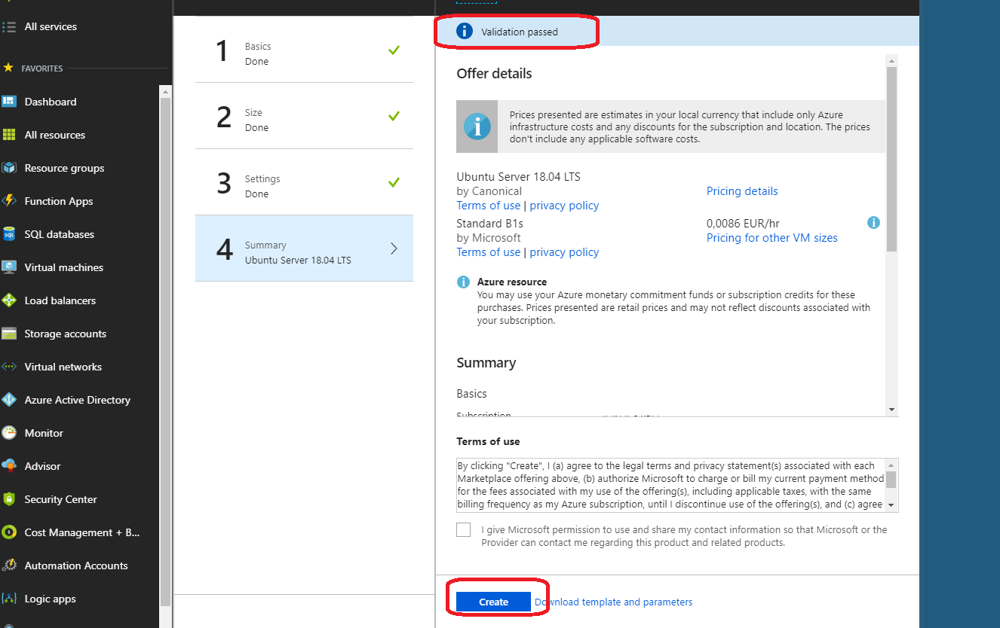

Repeat the same steps to create a new VM named "testonoff-2".

#### Tag the VMs

After few minutes the VMs will be available on Azure console.
Filter the VMs by name and click on the hostname.
Then click on "Tags" to tag the VM.

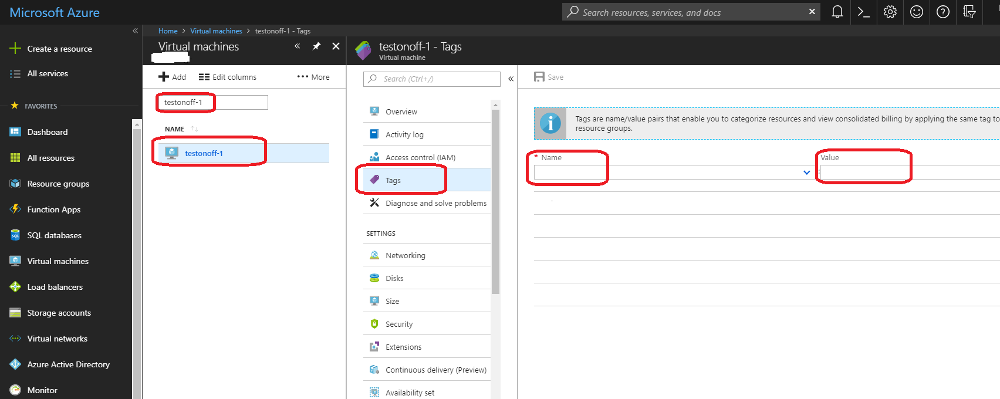

Now we need to insert the tags reported above.

About on-hour and off-hour tag you need to insert the approssimatevely hour on which you wuold like to start/stop the VMs.
E.g. Imagine that the VM testonoff-1 hosts a database and testonoff-2 hosts and application server. Logically the database should start before the application server.
Viceversa in the stop procedure we should first stop the application server and then the database.
If you wuould like to start the VMs at 09:00 and stop it at 19:00 (Rome time zone) you need to set the tag as the followings: (my timezone up to now differs from UTC about 2 hours).

**tags about testonoff-1**

on-off:yes

on-hour: T07

off-hour: T17 

on-group-order: 1

off-group-order: 2

**tags about testonoff-2**

on-off:yes

on-hour: T07

off-hour: T17 

on-group-order: 2

off-group-order: 1


Ok we completed the tag of our resources.

The next step is to create the logical flow of switch off-on the VMs with Logic Apps.

### Create Logic Apps flow intro

Azure Logic Apps allow the design of simple task with a lot of connectors (gmail, twitter, facebook, and much more https://docs.microsoft.com/en-us/azure/connectors/apis-list).

More information about Logic Apps are available here (https://docs.microsoft.com/en-us/azure/logic-apps/).

Basically I need two Logic Apps:

* start-vm: the Logic Apps that start the Vms
* stop-vm:  the Logic Apps that stop the Vms

Each Logic Apps will use other piece of code to achieve its goal.

I choose Azure Function to realize piece of code.

#### Azure Functions

Azure Functions lets you execute your code in a serverless environment.

More detail about Azure Functions are available here https://docs.microsoft.com/en-us/azure/azure-functions/functions-create-first-azure-function.

In details I'm going to create the following Azure functions:

1. RetrieveVMlist: This function will retrieve the list VMs that has tags on-off equals to yes
2. Start-StopVMs: This fuction will start/stop the VM depending on inputs parameters
3: CheckVMStatus: This fuction check if a VM started is running

Let's start with the first fuction!
Click on "Create Resource" and select "Function Apps".

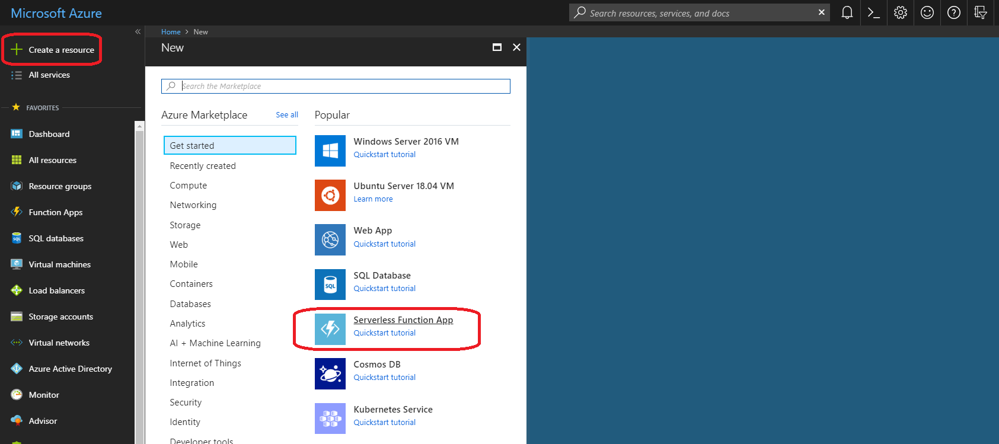

Insert the proper parameter(my Function Apps is named "testmyfunctionsnow").

Now click on "Function Apps" and add new function.

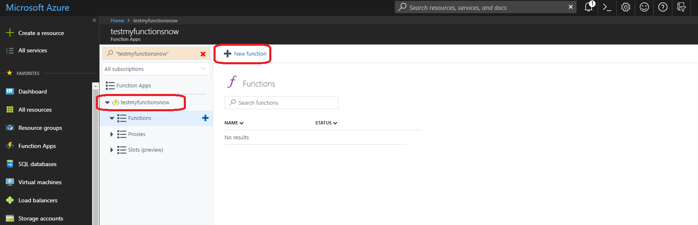

Now enable experimental language and choose "Powrshell" (to quickly drive into this guide we will use Powershell but you can use any language that you prefer).

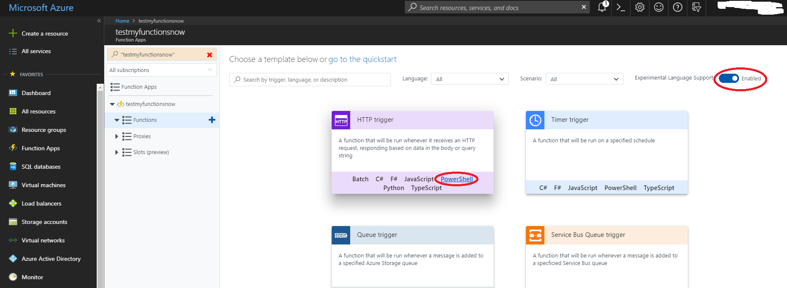
 
Set the function name like RetrieveVMlist and click on "Create".
The authorization is function in order to let Function Apps to proper create it.

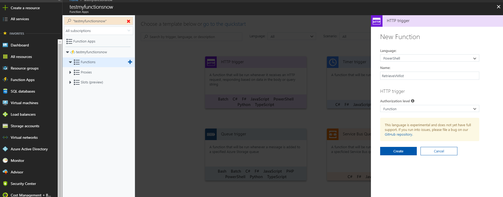

Now copy the code available here here:

([RetrieveVMlist.code](https://github.com/emilianoangieri/Azure-Documentation/blob/master/Azure-Serverless/Azure-Switch_off_VMs_with_Logic_Apps/functions_code/RetrieveVMlist/function_code.txt))

The function retrieve all the VMs with on-off tag equals to yes and create a JSON output like the following:

```json
[
  {
    "Name": "testonoff-1",
    "VmSize": "Standard_B1s",
    "ResourceGroup": "AUTOMATION-RSG",
    "Tags": {
      "on-hour": "T15",
      "on-off": "yes",
      "off-hour": "T15",
      "off-group-order": "1",
      "on-group-order": "2"
    },
    "PrivateIp": "10.0.0.4"
  },
  {
    "Name": "testonoff-2",
    "VmSize": "Standard_B1s",
    "ResourceGroup": "AUTOMATION-RSG",
    "Tags": {
      "on-off": "yes",
      "on-hour": "T15",
      "on-group-order": "1",
      "off-hour": "T15",
      "off-group-order": "2"
    },
    "PrivateIp": "10.13.85.5"
  }
]
```

Furtermore this function use the Service Principal to login in and call Azure API.
More information about Service Principal here https://docs.microsoft.com/en-us/azure/azure-resource-manager/resource-group-create-service-principal-portal.

To let the function working properly we need to add the passowrd of Service Principal in the testmyfunctionsnow configuration.

Click on the Function Apps "testmyfunctionsnow" and click on "Application settings".

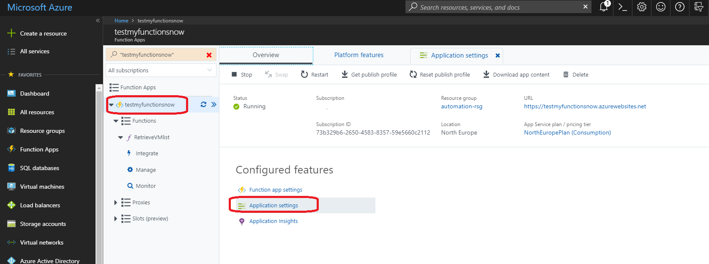

Now click on "Add new Setting" and insert a variable named SERVICE_PRINCIPAL_PASS and type your password used to create a Service Principal account.
Inser the APPLICATION_ID and the TENANT_ID based on your Azure Account.

Scroll up and click on "Save".

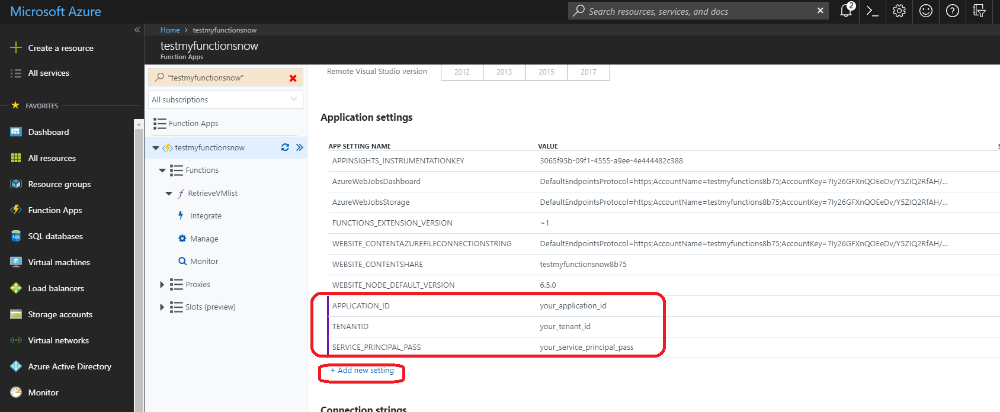

Now we can test the new function created.
Click on the function name and then click on "Run".

If everything is working properly you should see an output like this:

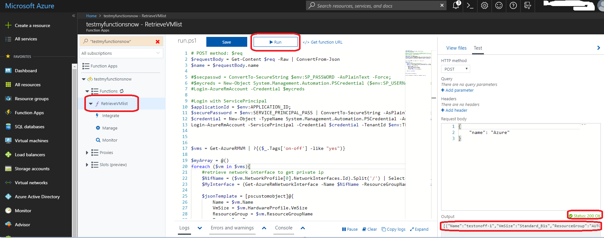

The next step is create the function Start-StopVMs that will accomplish the switch on-off task.

Click again on "testmyfunctionsnow" and click on "New Function".

As we previous did, Enable sperimental language choose Powershell and click on Create.
Insert the name Start-StopVMs.

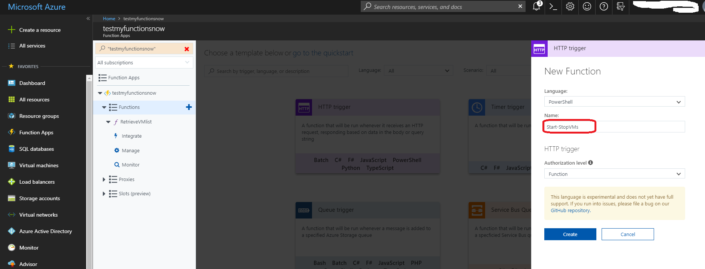

Now copy the code available here here:

([Start-StopVMs.code](https://github.com/emilianoangieri/Azure-Documentation/blob/master/Azure-Serverless/Azure-Switch_off_VMs_with_Logic_Apps/functions_code/Start-StopVMs/function_code.txt))

This function receive in input the following parameter and start or stop a VMs depending on the $action parameter:

```json
{
    "action": "Stop-AzureRmVM", ##or Start-AzureRmVM
    "ResourceGroup" : "AUTOMATION-RSG",
    "VMname" : "testonoff-1"

}
```

Now I need to creat the last function named CheckVMStatus.
Click again on "testmyfunctionsnow" and click on "New Function".

As we previous did, Enable sperimental language choose Powershell and click on Create.
Insert the name CheckVMStatus.

Now copy the code available here here:

([CheckVMStatus.code](https://github.com/emilianoangieri/Azure-Documentation/blob/master/Azure-Serverless/Azure-Switch_off_VMs_with_Logic_Apps/functions_code/CheckVMStatus/function_code.txt))

Everything is ready to create the flow with Logic Apps!


#### Azure Logic Apps detailed flow


In order to create the Logic Apps flow, click on "All Services" filter by "Logic Apps" and click on "Logic Apps".

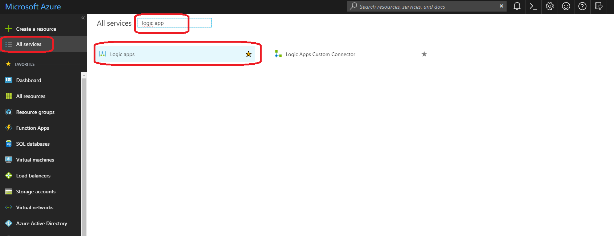 ->>>>>>>>>>>>>>>>>>>>>>

Now click on "+ Add".

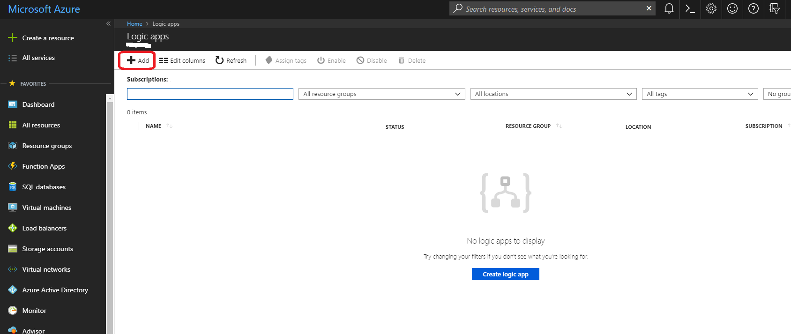

Insert the name (e.g. start-vm) the region, the resource group and click on "Create".

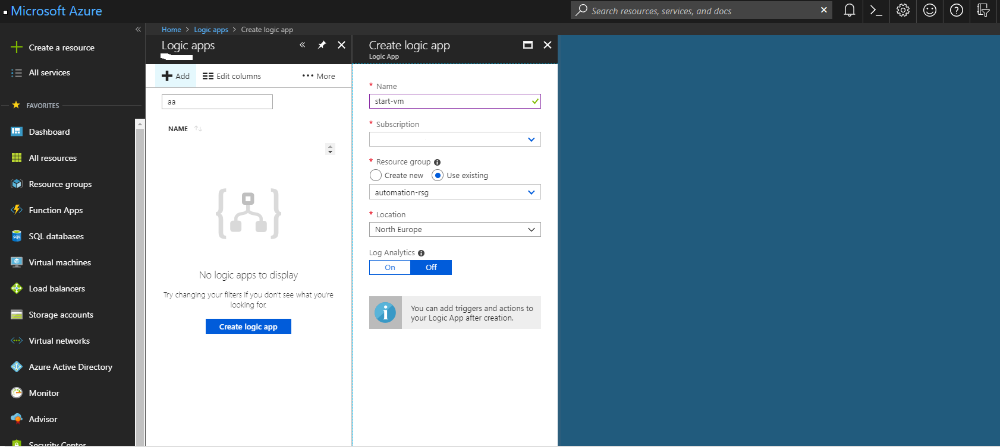

Wait until the Resource is ready.

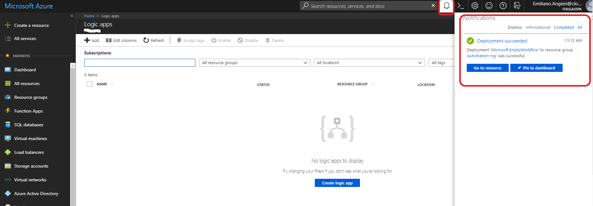

Then click on the name of the new Logic Apps created.

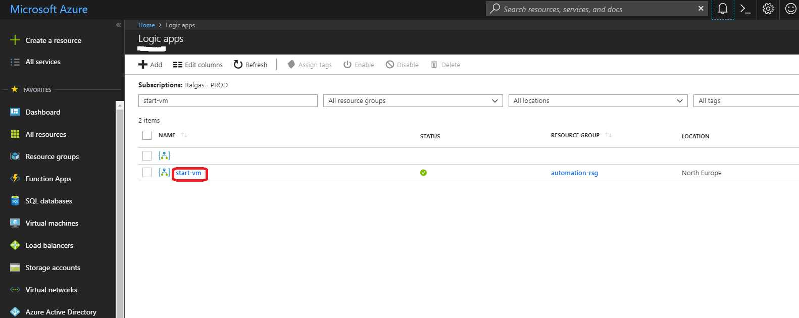

Now I'm going to realize the algorith that will be used to switch on the VMs.

It is very simple and I'm going to report a simple pseudo code below:

```
Cron scheduled every hour
Retrieve current timestamp
Retrieve VMs lists with tag On-off == yes
For i=1 to 10 
	For each VM in list vm
		If on-group-order ==  i and vm on-hour == current hour timestamp
			Start
			Check eventuali salvati su tableCron schedulata
Recupera lista vm con tag On-off == yes
Per i=1 to 10 (cicla per On-group-order)
	Per ogni macchina in lista vm (parallelizzato)
		If on-group-order ==  i and vm on-hour == hour now
			Start
			Check if VM is started
```

As First step I'm creating a recurrence schedule about this Logic Apps.

I schedule the Logic App every hour in order to check if there are VMs that needs to be started.

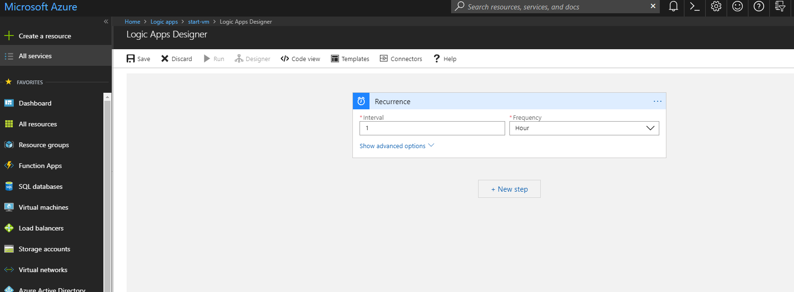

Now create a next steps as "Initialize variable".
Choose the name like "timestamp", type like string and click on value, choose "Expression" and insert utcNow().
This function will take the UTC time in the following format: YYYY-MM-dd:Thh:mm:ssZ (e.g. 2017-04-12T05:30:00Z)

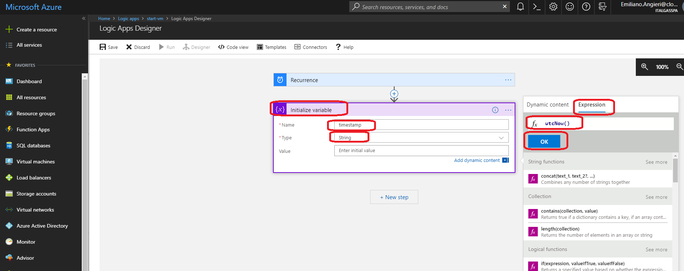

Now we need to invoke the Azure Function RetrieveVMlist created above.
Now the fantastic Logic Apps connector give us an incredible opportuinity to simply call this Azure Function.

Select "+ New Step" and Azure Function and now selecting "testmyfunctionsnow" you can choose all the function previously created!

Select RetrieveVMlist.

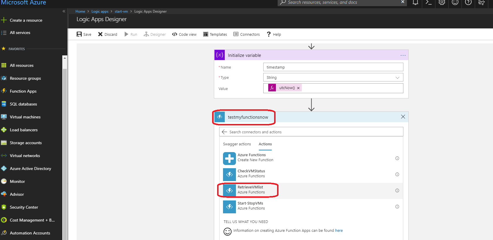

Now I'm going to create a loop variable that iterate the external loop from 1 to 10 (I'm supposing to have at most 10 on/off-group-order).

Click on "+ New Step" and select "Variable" -> "Initialize Variable".

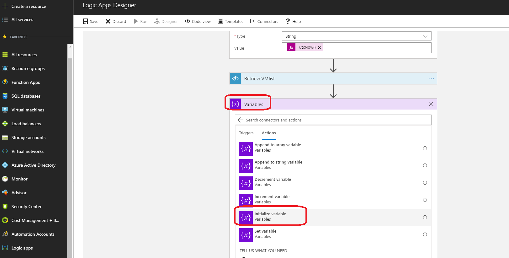

Rename the item into "loop variable".

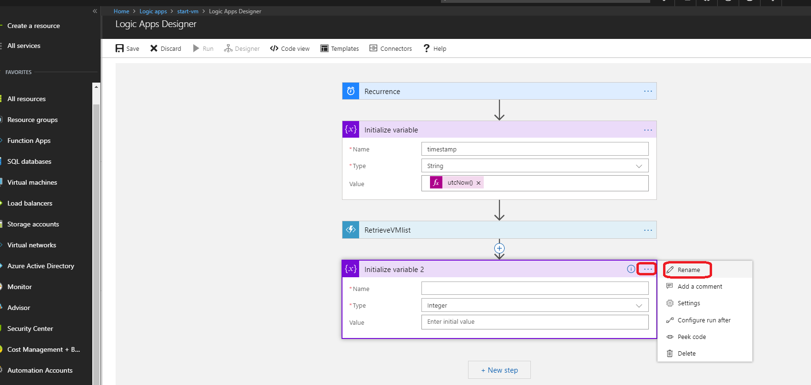

Then select it as integer and assign 1 as initialization value.

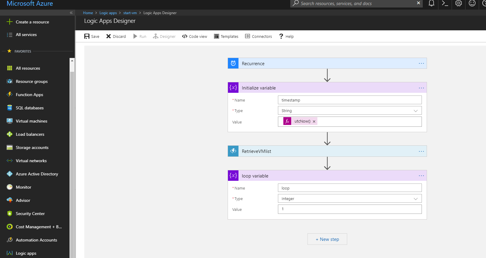

Now create the until loop that iterate until loop variable reach 10.
The very intresting thing that we can use some value previosly created in Logic App section.
In this case I'm going to reuse the variable loop.

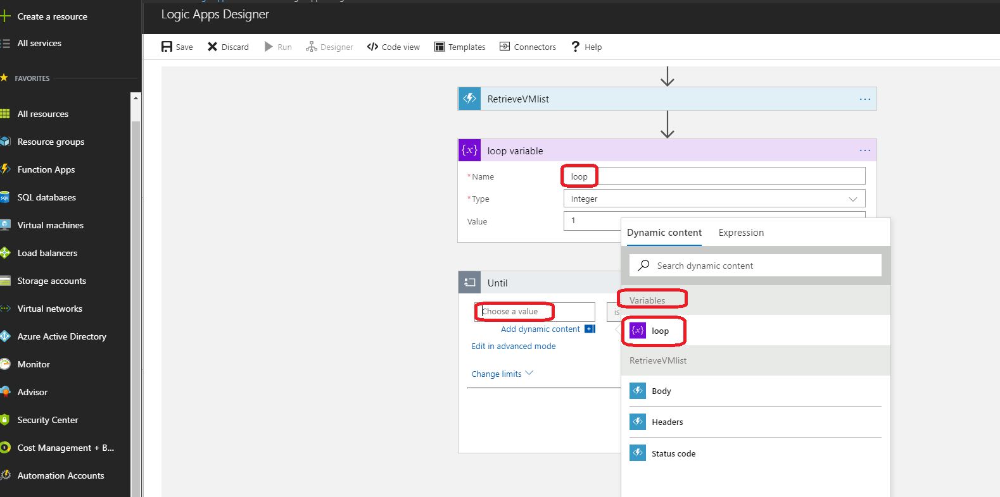

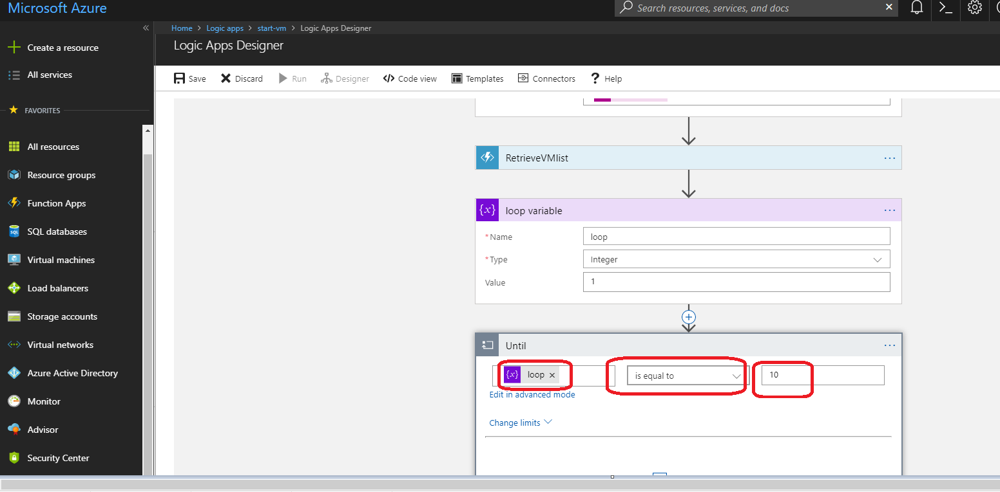

Now add the action that will process all the VMs retrieved and switch on the VMs based on the tags.
Create a For each action for each element previously retrieved from RetrieveVMlist action.

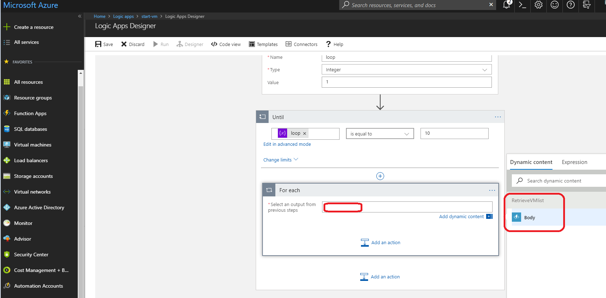

Now we can add a "Parse Json" to bettere manipulate the output of prevoius status.
As schema property use the following:

```json
{
    "properties": {
        "Name": {
            "type": "string"
        },
        "PrivateIp": {
            "type": "string"
        },
        "ResourceGroup": {
            "type": "string"
        },
        "Tags": {
            "properties": {
                "on-group-internal-order": {
                    "type": "string"
                },
                "on-group-order": {
                    "type": "string"
                },
                "on-hour": {
                    "type": "string"
                },
                "on-off": {
                    "type": "string"
                }
            },
            "type": "object"
        },
        "VmSize": {
            "type": "string"
        }
    },
    "type": "object"
}
```

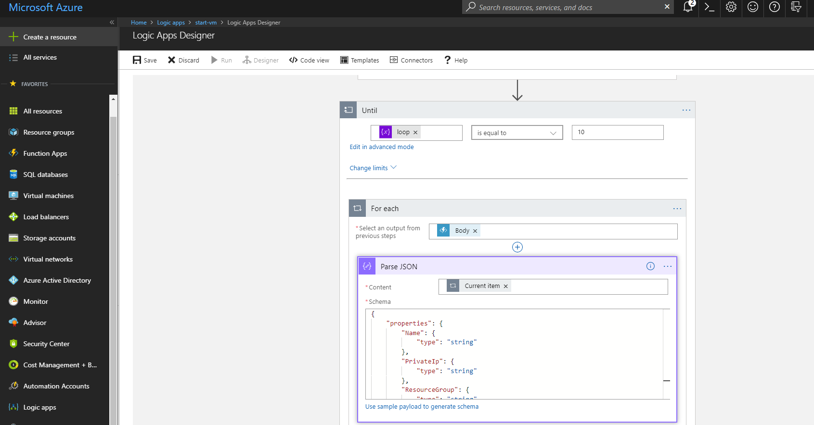

Now we can check if the current item of the list (that contains the VMs) is part of on-group-order (compared with loop iteraction variable) and then I will check if the tag of the current VM "on-group-order" is like the current timestamp hour.
e.g.
In the first iteration the loop variable is equal 1.
Supposing that the first element in VMs list is testonoff-1 (that represent the database and should start as first VM).
It's tag on-group-order is equal to 1, this means that loop and on-group-order are equal.
Th other condition is about on-hour (that we set to T07). Supposing that the current Logic Apps is running at 07:00 a.m. the condition is satisfied and the true part of Logic Apps will be invoked.

To recap:

startOfHour(variables('timestamp')) is the first condition value, compared to on-hour (of parse json item).

The second condition is:

on-group-order is equal to loop variable.

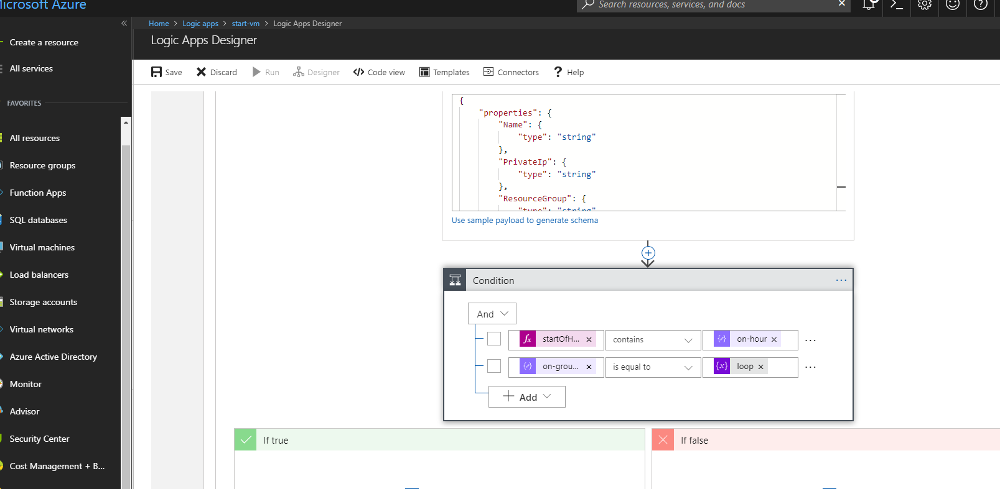

Now if the condition is true the VM need to be started.
Click on "+ Next Step" and add the Azure Function Start-StopVMs.

As body in input to this function I need to pass the ResourceGroup of the VM (retrievable from the Parse Json previous configured), with VM hostname and action (in this case Start-AzureRmVM).

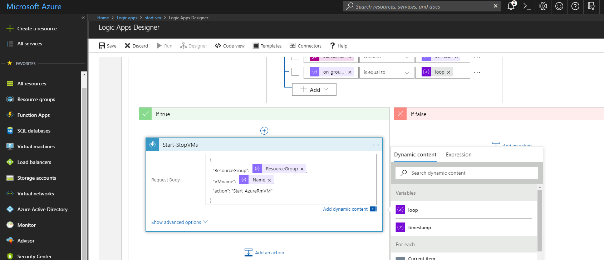

Now add a delay of 1 minute before check the VM status.

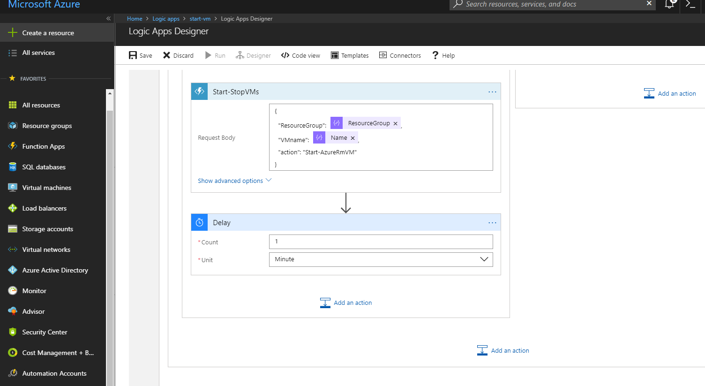

Then call the Azure function CheckVMStatus

Passing the ResourceGroup and the Name of the current VM.

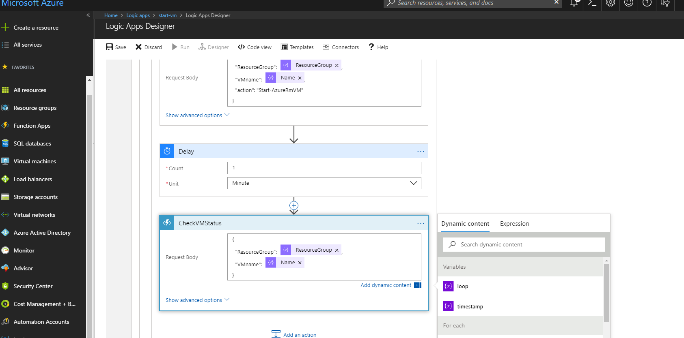

Now add another Parse Json to parse the result of the previous Azure Function CheckVMStatus.

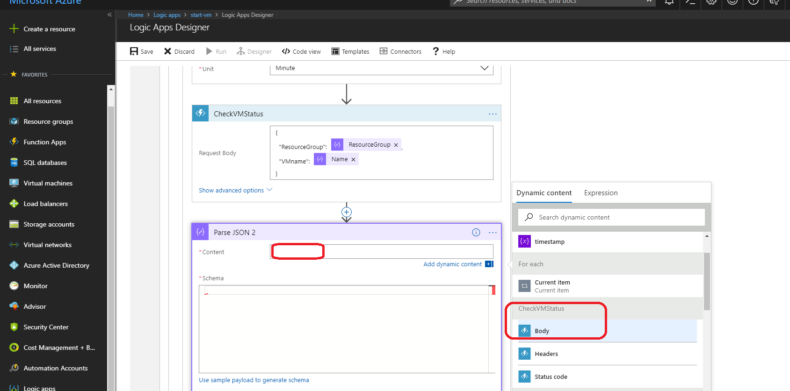

Use as schema the following:

```json
{
    "properties": {
        "Name": {
            "type": "string"
        },
        "Status": {
            "type": "string"
        }
    },
    "type": "object"
}

```
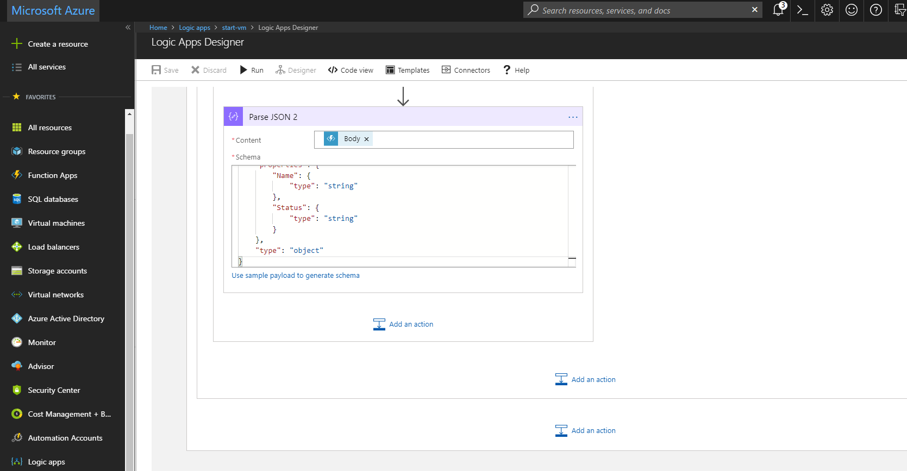

Finally check the stauts of the VM. If it is not equal to "VM running" send email through gmail connector (you could use office365 connector as well, as you prefer).

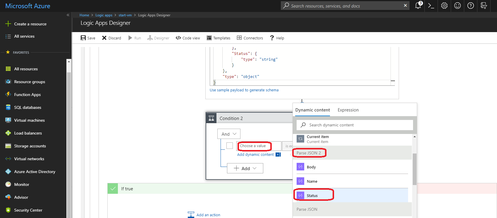

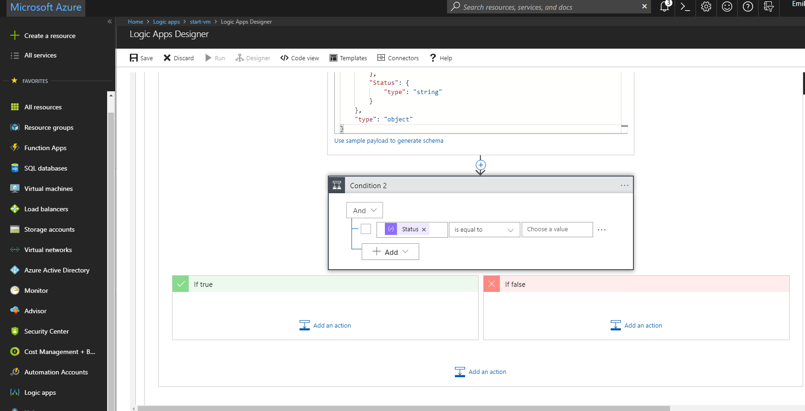

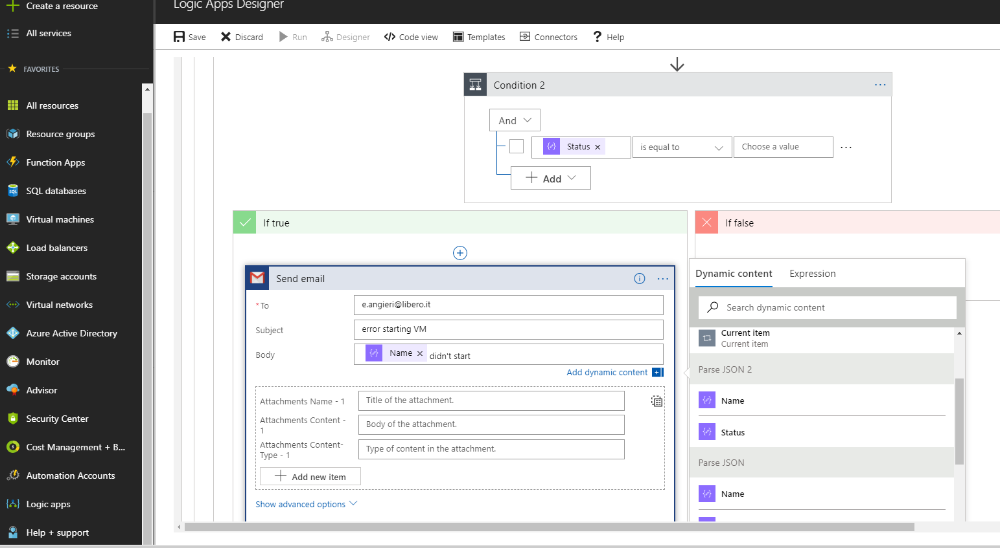

Do not forget to add the increment loop variable at the end of for each previously created.

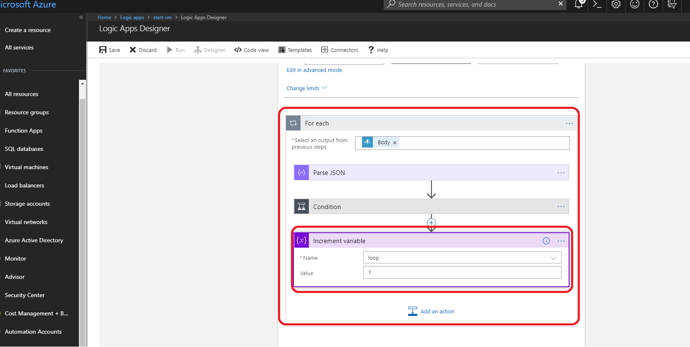


Now the function start-vm is ready to run!
Just check the proper tag on-hour in order to trigger it properly.

The stop-vm Logic Apps is exactly the same of start-vm.
You need to change only the condition putting off-hour instaed of on-hour and change the action of Start-StopVMs into Stop-AzureRmVM.

Try yourselves and in case of problem reach me via standard channel.

Enjoy the cloud and save your money!


#### About author

My Name is Emiliano Angieri and I'm a Cloud engineer expert with passion for all cloud applications and best practicies.

Do you need support, help or clarifications?
Follow me on linkedin https://www.linkedin.com/in/emiliano-angieri-49908478/ or ask me a question to e.angieri@libero.it.


